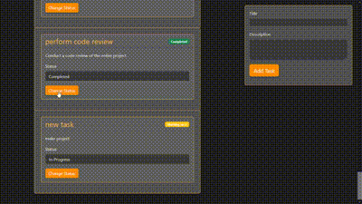
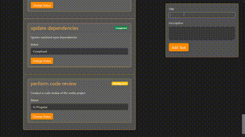
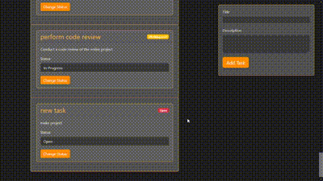
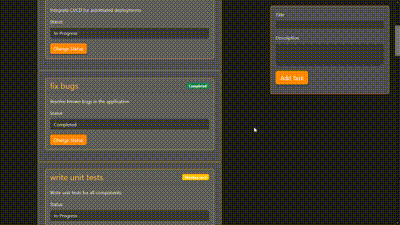

## Task Manager App

The Task Manager App allows users to manage tasks efficiently by providing a clean and intuitive interface built with Angular. The app is styled using Bootstrap for responsive design and modern aesthetics.
Key Features:

    Task List Display:
        The app displays a list of tasks with their respective details: task title, description, and status.
        Tasks are displayed in a card-based layout, with each card showing the task information and controls for changing the status.

    Add New Task:
        A static form positioned at the top of the page enables users to add new tasks. The form remains fixed in place even when the user scrolls the page, ensuring easy access.
        

        The form includes fields for entering the task's title, description, and selecting its initial status from a dropdown (with options: OPEN, IN_PROGRESS, DONE).
        Bootstrap form validation ensures users enter valid data before submitting.
    
        

    Change Task Status:
        Users can change the status of each task directly from the task card using a dropdown or status toggle.
        The app dynamically updates the task's status without reloading the page, and the status change is reflected in the task list.

        

    Filter Tasks by Status:
        A filtering mechanism is available at the top of the task list, allowing users to filter tasks by status (ALL, OPEN, IN_PROGRESS, DONE).
        Users can quickly view tasks based on their current state by selecting the appropriate status filter.
        The filtered list updates instantly, providing a seamless experience.

        

    Responsive Design:
        The app is built with Bootstrap’s responsive grid system, ensuring it adapts to various screen sizes (mobile, tablet, desktop).
        The static task form is placed in a fixed position using Bootstrap’s positioning utilities (position-fixed), making it accessible even when scrolling through the task list.